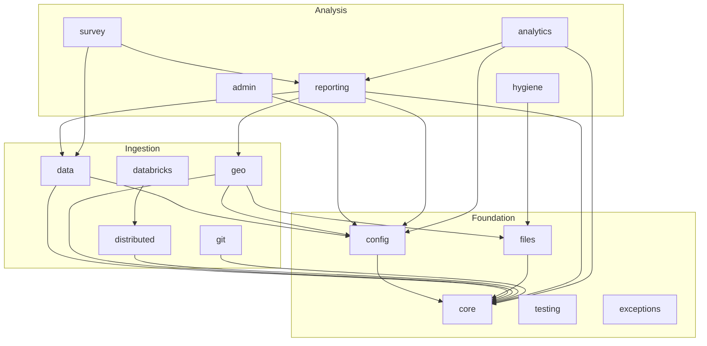

# siege_utilities — Architecture

**Goal:** three-layer model with a single invariant ("imports go DOWN") and a table of structural decisions.

**Scope:** ELE-2417 (audit sub-issue 2/6). Consumes [INTENT.md](INTENT.md) and [FAILURE_MODES.md](FAILURE_MODES.md). Ships [ADRs](adr/) for each decision. Snapshot: 2026-04-22 (revised 2026-04-23).

## Layer model

| Layer | Modules | Rule |
|---|---|---|
| **Foundation** | `core/`, `conf/`, `config/`, `files/`, `testing/`, `exceptions.py`, `runtime.py` | No deps on any other layer |
| **Ingestion** | `data/`, `geo/`, `distributed/`, `databricks/`, `git/` | Consumes Foundation only |
| **Analysis + output** | `reporting/`, `survey/`, `analytics/`, `admin/`, `hygiene/`, `development/` | Consumes Foundation + Ingestion |

**Invariant:** imports go DOWN. `core/` cannot import from `reporting/`. A utility that would create an upward edge belongs in a lower layer.

## Dependency diagram

A follow-up PR will add a `pydeps` CI check that fails on upward edges.

## ADR register

| # | Title | Status | Tracked under |
|---|---|---|---|
| [0001](adr/0001-chain-to-argument-pipeline-ownership.md) | Chain → Argument pipeline ownership | **Accepted** | ELE-2441 |
| [0002](adr/0002-chart-map-generator-injection.md) | Chart / map generator injection | **Accepted** | ELE-2441 |
| [0003](adr/0003-boundary-provider-registry.md) | BoundaryProvider registry pattern | Proposed | ELE-2438 (structural); later epic for interface |
| [0004](adr/0004-dataclass-vs-pydantic.md) | Dataclass vs Pydantic boundary | Proposed | ELE-2420 |
| [0005](adr/0005-lazy-import-convention.md) | Lazy-import convention | Proposed | ELE-2420 |
| [0006](adr/0006-polling-analyzer-location.md) | PollingAnalyzer deprecation | **Accepted** | ELE-2439 + ELE-2440 |
| [0007](adr/0007-argument-tabletype-location.md) | Argument + TableType location | Proposed | ELE-2420 |

## Consumer extras and the upward-import trap

The "Analysis + output" layer (`reporting/`, `survey/`, `analytics/`,
`admin/`, `hygiene/`) ships as **optional extras** in `pyproject.toml`
(`[reporting]`, `[survey]`, `[analytics]`, …). The trap that catches
agents and refactor-happy contributors is:

> *"This helper in `reporting/` is generic. Let me move it down into
> `core/` or `data/` so other code can use it."*

Don't. Even if the helper is technically generic, moving it down pulls
the heavy reporting-extra deps (matplotlib, seaborn, folium, reportlab)
into a layer that's supposed to install with no graphics stack. The
foundation has to be installable on a Spark worker without a display
server; an upward edge breaks that.

**Rules of thumb:**

1. If consumer code wants something from a lower layer, **the lower
   layer adds the abstraction** (see `DataFrameEngine` for why we don't
   special-case backends in `reporting/`).
2. If two consumer modules genuinely share a helper, the helper lives
   in **whichever consumer module owns the larger half** of the
   surface — not in a foundation layer.
3. The `[all]` extra exists for end-user convenience. It is not an
   excuse for an internal module to assume `[all]` is installed.

The single invariant — **imports go DOWN** — is what keeps a `pip install
"siege-utilities[geo]"` lean and predictable on a 4 GB EC2 image.

## Known invariant violations

| Violation | Resolution | Target |
|---|---|---|
| `survey/` imports `Argument` / `TableType` from `reporting/pages/` | Move to `reporting/models.py`; old path re-exports (deprecation shim) | ADR 0007 |
| `reporting/analytics/polling_analyzer.py` — analytics inside reporting | Deprecate class; redistribute guts by nature | ADR 0006 / ELE-2439 |
| `data/redistricting_data_hub.py` — provider inside data-ops module | Move to `geo/providers/` | ELE-2438 (D3) |
| `data/` bundles four natures (stats, reference, infra, provider) | Aggressive split | ELE-2437 (D2) |

## Migration phases

| Phase | Work | Risk | Under |
|---|---|---|---|
| **M1** | Land ADRs + dep-direction CI check (docs, no code) | None | ELE-2417 (this PR) |
| **M2** | Structural moves: `data/` split, `geo/providers/`, delete `reporting/analytics/` | Low (re-export shims) | ELE-2437, 2438, 2439 |
| **M3** | Ownership consolidation: rendering pipeline, PollingAnalyzer deprecation, waves subsystem | Medium (public API) | ELE-2440, 2441 |
| **M4** | Provider interface unification (common `fetch`/`accepts` shape) | Medium | Post-audit epic |

## Non-goals for this epic

| Non-goal | Reason |
|---|---|
| Wholesale rewrite of `reporting/` | Separate larger effort |
| Break notebook-facing API during M1/M2 | Notebooks rewritten in ELE-2421 once new shape is in |
| Major version bump | Every phase ships as minor with deprecation shims |

See also: [INTENT.md](INTENT.md) · [FAILURE_MODES.md](FAILURE_MODES.md) · [TEST_UPGRADES.md](TEST_UPGRADES.md) · [adr/](adr/)
