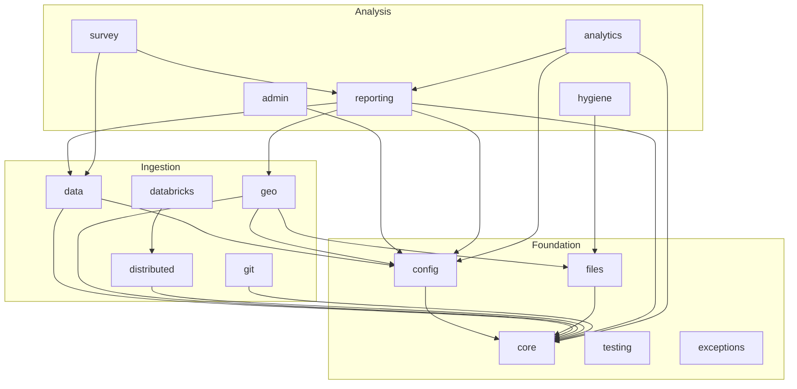

# siege_utilities — Architecture

Per **ELE-2417** (audit sub-issue 2/6). Consumes `docs/INTENT.md` (ELE-2416) and `docs/FAILURE_MODES.md` (ELE-2418) as inputs. Ships ADRs in `docs/adr/` for each structural decision.

## The view from 10,000 feet

```
                        ┌──────────────────────────┐
                        │  siege_utilities (lib)   │
                        └──────────────────────────┘
                                    │
           ┌────────────────────────┼────────────────────────┐
           │                        │                        │
   ┌───────▼───────┐        ┌───────▼───────┐        ┌───────▼───────┐
   │   core +      │        │   data +      │        │   reporting + │
   │   config +    │        │   geo +       │        │   survey +    │
   │   files +     │        │   distributed │        │   analytics   │
   │   testing     │        │               │        │               │
   └───────────────┘        └───────────────┘        └───────────────┘
     foundation               ingestion                 analysis +
     (no deps on              (consumes                  output
      other subtrees)          foundation)               (consumes
                                                          foundation +
                                                          ingestion)
```

Three layers:

1. **Foundation** — `core/`, `config/`, `conf/`, `files/`, `testing/`, `exceptions.py`, `runtime.py`. Nothing here depends on `geo/`, `reporting/`, `survey/`, `analytics/`. Imported by everything else.
2. **Ingestion** — `data/`, `geo/`, `distributed/`, `databricks/`, `git/`. Pulls data in. Consumes foundation but not analysis.
3. **Analysis + output** — `reporting/`, `survey/`, `analytics/`, `admin/`, `hygiene/`, `development/`. Consumes both lower layers.

**Invariant:** imports go DOWN. `core/` cannot import from `reporting/`. If a new utility is discovered that would create an upward edge, it belongs in a lower layer.

## Dependency diagram (current — per `pydeps` pass)

*(Actual auto-generated diagram belongs in a follow-up PR; this ADR set pins the intended shape. The follow-up will add a CI check that compares actual vs. intended and fails on violations.)*



**Known violations** to be resolved by ADRs below:
- `survey/` imports `Argument` / `TableType` from `reporting/pages/` — resolved by ADR 0007 (move to `reporting/models.py`, consumers stay stable)
- `reporting/analytics/polling_analyzer.py` is analytics living inside reporting — ADR 0006 proposes a split

## ADRs

| # | Title | Status |
|---|---|---|
| 0001 | Chain-to-Argument pipeline ownership | Proposed |
| 0002 | Chart / map generator injection | Proposed |
| 0003 | BoundaryProvider registry pattern | Proposed |
| 0004 | Dataclass vs Pydantic boundary | Proposed |
| 0005 | Lazy-import convention | Proposed |
| 0006 | polling_analyzer location | Proposed |
| 0007 | Argument + TableType location | Proposed |

## Migration plan

Each ADR names its consumers and sequences the rollout so downstream callers (notebooks, client code) don't break mid-refactor.

### Phase M1 — Documentation + invariants (this PR + companion CI)
- Land all 7 ADRs
- Land the dependency-direction invariant as a CI check (imports go DOWN)
- No code changes yet

### Phase M2 — Structural moves (low-risk; under ELE-2420)
- ADR 0007: move `Argument` / `TableType` to `reporting/models.py` with re-exports from old location for one minor version
- ADR 0006: split `polling_analyzer` — generic functions to `analytics/polling/`, reporting-specific heatmap/trend chart to stay

### Phase M3 — Ownership consolidation (ELE-2420)
- ADR 0001: pick one canonical entry point for Chain → Argument; the other delegates
- ADR 0002: remove the unused injection kwargs

### Phase M4 — Architectural patterns (ELE-2420 + future epic)
- ADR 0003: registry pattern for BoundaryProvider
- ADR 0004: where Pydantic begins (new external-facing types)
- ADR 0005: standardize lazy-import discipline

## Non-goals for this epic

- No wholesale rewrite of `reporting/` — that's a separate larger effort
- No change to the public notebooks-facing API during M1/M2 (notebooks will be rewritten in ELE-2421 to use the new shape)
- No breaking version bump — all phases land as minor versions with deprecation notices where needed

## See also

- `docs/INTENT.md` — what each module is for
- `docs/FAILURE_MODES.md` — where silent failures hide
- `docs/TEST_UPGRADES.md` — test-quality plan
- `docs/adr/` — individual ADRs
